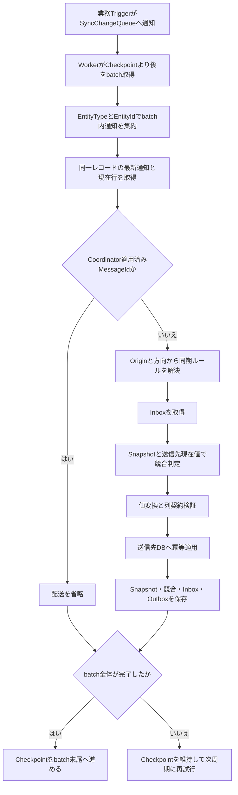
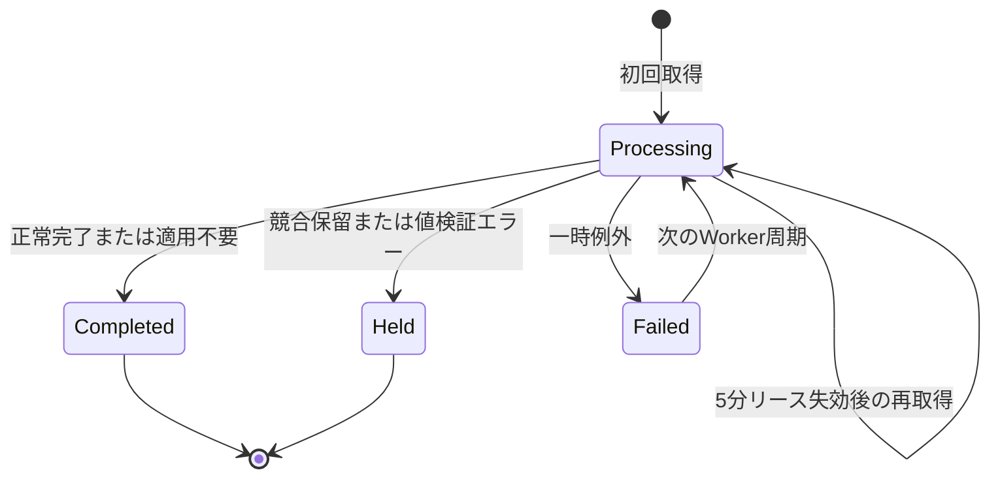

# SyncCoordinator 技術仕様書

## 1. 本書の目的

本書は、SyncCoordinatorの現在の実装に基づき、構成、同期処理、状態管理、永続化、セキュリティ、配備および運用上の制約を説明する。

画面の操作手順は本書の対象外とする。設計判断の経緯は[`decisions`](decisions)のADRを参照し、本書では現在動作している仕様を正とする。

## 2. 適用範囲と非対象

SyncCoordinatorは、複数のRDB間で業務レコードの最終状態を一致させるstate synchronizationを行う。対応する業務DBは次のとおりである。

- SQL Server
- MySQL
- PostgreSQL 13以降

次の用途は対象外である。

- 承認、在庫移動、仕訳など、中間イベント自体に業務上の意味があるイベント配送
- 分散トランザクションによる管理DBと業務DBの一括コミット
- 条件に応じて送信先を切り替えるルーティング
- 管理画面からの失敗・保留データの手動再実行
- 管理画面からのコンフリクト解決
- 業務DB間の全件比較と自動修復
- 監査履歴のエクスポート

## 3. ソリューション構成

### 3.1 プロジェクト

| プロジェクト | 責務 |
|---|---|
| `SyncCoordinator.Contracts` | Connector間で使用するpayload、変更通知、適用要求の共通契約 |
| `SyncCoordinator.Core` | 同期ユースケース、競合判定、値変換、設定検証、抽象インターフェース |
| `SyncCoordinator.Infrastructure` | 管理DBのEF Core永続化、RDB Connector、DB配備、Webhook、Data Protection |
| `SyncCoordinator.Worker` | 同期、Webhook配送、自動クリーンアップを周期実行するBackground Service |
| `SyncCoordinator.Web` | Blazor Interactive Serverによる管理画面と管理者認証 |
| `SyncCoordinator.AppHost` | Aspireによるデモ構成またはCoordinator単体構成の起動 |
| `SyncCoordinator.ServiceDefaults` | OpenTelemetry、service discovery、resilience、Health Check |
| `SyncCoordinator.Tests` | CoreおよびInfrastructureの単体・永続化テスト |

### 3.2 依存方向

```text
Contracts <- Core <- Infrastructure <- Worker
                              ^
                              +-------- Web

ServiceDefaults <- Worker / Web
AppHost ---------> Worker / Web / demo resources
Tests -----------> Contracts / Core / Infrastructure
```

Webは同期処理や業務DB Connectorを直接実行しない。設定更新はCoreの管理サービス境界を通じて行い、同期判断は`SynchronizationCoordinator`へ集約する。

## 4. 実行トポロジー

### 4.1 通常構成

通常構成は次の要素から成る。

- Coordinator管理DB: SQL Server
- Coordinator Web: 管理画面、認証、設定、DB配備操作
- Coordinator Worker: 同期処理、Webhook配送、自動クリーンアップ
- 1つ以上の業務DB

Workerへ必要な起動時接続文字列は`ConnectionStrings:coordinator-db`である。業務DBのProviderと接続情報は管理DBを正本とし、Workerの設定ファイルへシステム別に重複定義しない。

### 4.2 Aspireデモ構成

`Demo:Enabled`は未指定時も`true`である。デモ構成では次を起動する。

- SQL Server: Coordinator管理DB、CRM業務DB
- MySQL: Customer Portal業務DB
- PostgreSQL: Field Service業務DB
- Coordinator Web、Worker
- Customer Portal、CRM、Field Serviceのデモアプリ

Webが管理DBのmigrationとデモデータ投入を担当する。AppHostはデモ用業務DB接続文字列をWebへ渡し、Webが暗号化して管理DBへ保存する。WorkerはWebの起動完了後、管理DBからシステムと接続情報を取得する。

デモ用の固定ポートおよび既知のDBパスワードは開発専用であり、本番へ転用しない。

## 5. 管理DBを正本とするConnector解決

### 5.1 正本となる情報

`SystemDefinition`に保存した次の情報をConnector構成の正本とする。

- システムコード
- Provider
- 同期対象かどうかを示す`Enabled`
- Data Protectionで暗号化した接続文字列

対象システムの物理テーブル、列、キー、削除方式、値変換および固定値は、同期ルールに紐づくマッピングを正本とする。

### 5.2 解決タイミング

Workerは処理周期ごとにDI scopeを作成する。`ManagedConnectorCatalog`はそのscopeで最初に参照された時点に管理DBを読み、次の条件を満たすシステムだけからConnectorを生成する。

- `SystemDefinition.Enabled = true`
- 暗号化接続文字列が設定済み
- Providerが`SqlServer`、`MySql`、`PostgreSql`のいずれか

同一scope内では解決結果を再利用する。管理画面でシステム、Provider、接続情報または同期対象設定を変更した場合、次のWorker周期から反映され、Workerの再起動は不要である。既に開始した周期のConnectorは途中で差し替えない。

接続情報がないシステムは送信元Connector一覧へ含めない。処理中のルールが接続情報のない送信先を必要とした場合はその周期が失敗し、Checkpointを進めず次周期に再試行する。

## 6. 共通データ契約

### 6.1 EntityPayload

`EntityPayload`は、業務DB固有の列名を同期ルールの共通項目名へ変換した辞書である。

- Connectorが管理する同期対象項目を毎回同じ集合で返す。
- 部分payloadは使用しない。
- 項目が存在しない状態と、項目が存在して値が`null`の状態を区別する。
- キー列から組み立てる`EntityId`は最大256文字の文字列表現として扱う。

### 6.2 変更と適用

変更操作は`Upsert`と`Delete`である。業務DBのQueue行は過去状態を再生する命令ではなく、対象レコードの最新状態を再確認する通知として扱う。

適用要求には次を含む。

- 決定的に生成した`DeliveryMessageId`
- 発生元Queueの`SourceMessageId`
- 現在の送信元システムと最初の発生元`OriginSystem`
- EntityType、EntityId
- 操作、削除方式、payload

## 7. システム、同期ルール、マッピング

### 7.1 システム

- システムコードは登録後に変更できない。
- 接続情報登録後のProvider変更は拒否する。
- 有効な同期ルールで使用中のシステムは無効化できない。
- `Enabled=false`は構成から外す操作であり、運用一時停止とは異なる。
- 無効化時は個別一時停止状態を解除する。

### 7.2 同期ルール

1つの同期ルールは固定の送信元、固定の送信先、方向、競合設定を持つ。

- 片方向: 送信元から送信先だけを処理する。
- 双方向: 送信元から渡ったデータが送信先で更新された場合だけ、最初の送信元へ戻す。
- 送信先で独自作成したデータは、その双方向ルールの対象外である。
- 同一システム間のルールは拒否する。
- 内部`EntityType`は新規ルール作成時に自動生成し、利用者に入力させない。

ルールの状態は単一値ではなく、次の組合せで表す。

| 観点 | 状態 |
|---|---|
| DB反映 | `Draft` / `Prepared` |
| 同期対象 | `Enabled=true/false` |
| マッピング保守 | `MappingMaintenanceStartedAtUtc`の有無 |
| 運用停止 | 送信元または送信先システムの`PausedAtUtc` |

### 7.3 テーブル／列マッピング

同期ルールとテーブルマッピングは任意の1対1である。マッピングには次を保存する。

- 両端のschemaとtable
- 共通項目に対応する送信元列と送信先列
- EntityIdを構成する1つ以上のキー列
- 列別コンフリクトポリシー
- 両方向の値変換
- 方向別の固定値
- 両端の物理列型、NULL可否、文字列長、数値precision／scale
- 削除同期と両端の削除方式

同じシステムとEntityTypeに複数の有効ルールがある場合、物理テーブル、列契約および固定値が一致しなければ、曖昧な読み書きを避けるため処理を停止する。

### 7.4 マッピング変更時の保守

既存マッピングを保存する場合、先にルールをマッピング保守状態へ移し、`Enabled=false`にする。処理中Inboxの5分リースが残っていないことを最大10秒待ってから定義を切り替える。待機中は新規Inboxを取得せず、送信元Checkpointを進めない。

変更内容による扱いは次のとおりである。

| 変更 | `Prepared` | Canonical Snapshot | DB再反映 |
|---|---|---|---|
| コンフリクトポリシーのみ | 維持 | 維持 | 不要 |
| 方向別固定値のみ | 維持 | 維持 | 不要 |
| 値変換または列の値契約 | 維持 | 破棄 | 不要 |
| 物理列対応、キー、削除設定 | `Draft`へ戻す | 破棄 | 必要 |
| `Prepared`後の対象table変更 | 変更を拒否 | 変更なし | 廃止フローが先に必要 |

いずれの変更でもルールは保存後に無効となる。必要なDB検証を終え、ルールを再度有効化するとマッピング保守状態を解除する。

値変換だけを変更した場合は、Trigger等の物理構成が変わらないため`Prepared`を維持する。一方、旧変換規則で作られたCanonical Snapshotは新規競合判定の基準にできないため削除する。

## 8. 業務DBの準備とルール有効化

設定保存では業務DBへDDLを実行しない。専用画面で次の同期補助オブジェクトを作成するSQLを生成する。

- `SyncChangeQueue`
- `SyncAppliedMessage`
- `SyncEntityOrigin`
- `SyncDeleteTombstone`
- `SyncCoordinatorDeployment`
- 対象業務テーブルの変更検知Trigger

既存の業務テーブルおよび業務列は作成・変更しない。片方向では送信元だけ、双方向では両端にTriggerを作成する。

標準運用はSQLをダウンロードし、DBAが確認して実行する方式である。管理画面からの直接反映は`DatabaseDeployment:AllowDirectApply=true`の場合だけ許可し、対象DB名の再入力を必要とする。既定値は`false`である。

検証ではオブジェクトの存在だけでなく、`SyncCoordinatorDeployment`に保存された定義ハッシュが現在の設定と一致することを確認する。必要な両DBを検証できた場合だけ`Prepared`へ移行し、その後にルールを有効化できる。

ルールの無効化または削除ではTriggerを自動削除しない。既存Triggerを撤去する廃止フローは未実装である。

## 9. 同期処理フロー



### 9.1 Queue取得と最新状態への収束

送信元システム単位のCheckpointを使用し、`QueueId > LastQueueId`を昇順で設定件数まで取得する。batch内の同一EntityType／EntityIdは最後の通知に集約する。

各送信元のQueue取得、処理、Checkpoint更新は送信元単位で例外を分離する。ある送信元DBのQueue読取りなどが失敗した場合、その送信元のCheckpointは進めずシステムイベントへ対象システムコードを記録するが、独立したCheckpointを持つ他の送信元は同じWorker周期で処理を継続する。同じ送信元のbatch内で一時失敗した場合は、その送信元だけを打ち切って次周期に再試行する。

Checkpoint、Inbox、Snapshotは管理DBへ永続化する。Workerプロセスを再起動しても、停止前に確定したCheckpointの続きからQueueを取得する。停止中に追加された通知も失われず、決定的なDelivery Message IDと送信先の`SyncAppliedMessage`によって再起動をまたぐ重複適用を防ぐ。処理中に強制終了してInboxが`Processing`のまま残った場合は、5分の処理リース失効後に再取得する。

Connectorは取得通知以降にある同一レコードの最新Queue行も検索する。現在行があれば`Upsert`、現在行がなく最新通知が`Delete`なら対応するTombstoneから削除前payloadを復元する。現在状態も有効なTombstoneもなければ適用対象なしとする。

このため、停止中に`更新→更新`、`更新→削除`、`削除→再作成`が起きても中間状態を順に再生せず、処理時点の最新状態へ収束する。

### 9.2 ルール解決

送信元システム、`OriginSystem`、EntityTypeから対象ルールを取得する。双方向の戻り処理は、現在のシステムがルールの送信先であり、かつ`OriginSystem`が最初の送信元と一致する場合に限る。

ルールが個別停止またはマッピング保守中なら、共有Checkpointを進めずbatch全体を次周期へ延期する。

### 9.3 適用とSnapshot保存

送信先DBでは次を同じローカルトランザクションで実行する。

1. `DeliveryMessageId`の適用済み確認
2. `SyncAppliedMessage`への登録
3. Triggerへ引き継ぐMessageIdコンテキストの設定
4. 業務行のUpsertまたはDelete
5. Upsert時の`SyncEntityOrigin`更新、物理Delete時のOrigin削除
6. MessageIdコンテキストの解除

適用後、管理DBには送信元で観測したpayloadと送信先で観測または採用したpayloadを別々に保存する。双方向ルールでは逆方向判定に必要な反対側のSnapshotも保存する。

## 10. 冪等性と同期ループ防止

`DeliveryMessageId`は`SourceMessageId + RouteId + DestinationSystem`から決定的に生成する。同じ配送を再実行しても同じIDになる。

送信先Connectorは`SyncAppliedMessage`の一意性によって重複適用を防ぐ。Coordinatorによる更新では同じIDを次の仕組みでTriggerへ渡す。

- SQL Server: `SESSION_CONTEXT`
- MySQL: connection user variable
- PostgreSQL: transaction-local setting

TriggerはこのIDをQueueへ引き継ぎ、Workerは`SyncAppliedMessage`に存在する通知を読み飛ばす。管理DBと業務DBの間に分散トランザクションはなく、障害時はInbox、決定的な配送ID、送信先の適用済み記録を用いてat-least-onceで回復する。

## 11. Inbox状態と再試行

### 11.1 状態遷移



Inboxの一意キーは`SourceMessageId + RouteId + DestinationSystem`である。初回取得時に状態を`Processing`、AttemptCountを1、処理リースを5分に設定する。

- リース中の`Processing`は`Busy`として扱い、Checkpointを進めない。
- リース切れの`Processing`または`Failed`は再取得し、AttemptCountを加算する。
- `Completed`と`Held`は現在の実装では再取得しない。

Inbox取得後、完了状態を保存する前にWorkerが停止または異常終了した場合、Inboxは`Processing`、送信元Checkpointは未更新のまま残る。リース中は他のWorkerが取得せず、`LockedUntilUtc`の経過後に新しいWorker周期が同じInboxを再取得し、AttemptCountを加算して配送処理を最初から再実行する。送信先への適用後に中断していた場合も、決定的なDelivery Message IDと送信先の`SyncAppliedMessage`により重複適用を防ぐ。

### 11.2 `Failed`と`Held`の違い

`Failed`は処理中の例外により今回の試行が失敗した状態であり、次周期から自動再試行する。最大試行回数、同期処理用の指数バックオフ、恒久失敗への遷移はない。成功するまで該当送信元のCheckpointを進めないため、同じ送信元の後続処理も待機する。別の送信元は独立したCheckpointを使用するため処理を継続する。

`Held`は自動再試行しない要対応状態である。値変換や列契約の非一時エラー、Holdポリシーの競合、Merge実装がない競合が該当する。該当レコードをHeldとして確定した後はCheckpointを進め、他のデータを止めない。手動再実行は未実装である。

`Held`には競合保留と値検証エラーが含まれる。値検証エラーはInboxの`LastError`およびシステムイベントへ記録され、競合は`SyncConflict`の履歴から確認する。

## 12. 競合判定

### 12.1 3-way比較

競合判定では次を使用する。

- source base: 送信元で前回観測したpayload
- destination base: 送信先で前回観測または採用したpayload
- incoming: 今回の送信元payload
- current: 現在の送信先payload

項目ごとに、incomingとcurrentの両方が各自のbaseから変化し、かつ値が異なる場合だけ競合とする。片側だけの変更は自動マージする。初回同期ではincomingに存在する項目だけを反映し、送信先固有項目を維持する。

### 12.2 ポリシー

| ポリシー | 動作 |
|---|---|
| `HoldAndNotify` | currentを維持し、Heldにする |
| `ApplyIncomingAndNotify` | incomingを採用する |
| `KeepCurrentAndNotify` | currentを採用して完了する |
| `MergeAndNotify` | `IConflictValueMerger`へ委譲する。既定実装では推測せずHeldにする |

列別ポリシーを優先し、未指定列にはルール既定ポリシーを使用する。

Field scopeではHeldになった競合項目をcurrentのまま維持し、非競合項目や採用可能な項目を適用できる。Record scopeでHoldが1項目でも発生した場合、レコード全体をcurrentのまま維持する。

競合履歴にはbase、incoming、current、adopted、適用ポリシー、resolutionに加え、手動解決に必要な発生時点のSnapshotとpayloadを保存する。Heldとなった競合は`AwaitingDecision`になり、管理画面で項目ごとに受信値、同期先の現在値、手入力値を選択できる。削除競合は削除適用またはレコード維持を選択する。

解決要求は管理画面から業務DBへ直接適用せず、`Pending`として永続化する。Workerは適用前に同期先を再取得し、画面表示時の現在値トークンと一致するときだけ、競合専用の決定的Delivery Message IDで適用する。値が変化していれば`AwaitingDecision`へ戻し、二重適用や検出後の変更の上書きを防ぐ。成功時はSnapshot、Inbox、競合状態を更新し、選択内容、解決理由、実行者、時刻を保持する。

同じ同期ルール、同期先、エンティティ、レコードキーに複数の未完了競合がある場合、最古と最新だけを操作可能にし、中間は`WaitingForPrevious`とする。最古を解決した場合は次の競合を更新後の現在値とスナップショットで再評価し、保留が不要なら自動適用して順次進める。最新を解決した場合は先行する未完了競合を`Superseded`にし、解決要求を破棄する。管理DBの直列化トランザクションにより、解決要求の登録・適用と同じレコードへの新規競合登録を排他する。

## 13. 削除同期

削除同期はテーブルマッピング単位で有効化し、両端に次のいずれかを設定する。

- 物理削除: 業務行をDELETEする。
- 論理削除: 指定列へ指定値を書き込む。

物理DELETEのTriggerは削除前payload、OriginSystem、MessageIdを`SyncDeleteTombstone`へ保存してからDelete通知を追加する。論理削除では指定値への遷移をDeleteとして検知し、元のpayloadをTombstoneへ保存する。論理削除状態から復帰した変更はUpsertとして扱う。

送信先が前回Snapshotから変更されていなければ削除する。変更されている場合は競合として扱うが、Deleteは部分適用できない。変更済みの全項目が`ApplyIncomingAndNotify`の場合だけ削除し、`KeepCurrentAndNotify`はレコードを維持して完了、`HoldAndNotify`と`MergeAndNotify`はHeldにする。

## 14. 値変換と書込み前検証

列ごとにForwardとReverseの変換を別々に保存する。利用可能な変換は次のとおりである。

- コード対応表
- 未定義コードの拒否
- NULL時の既定値
- UTCへの日時正規化
- 明示的な文字列切詰め
- 明示的な小数丸め

既定では値を推測、切詰め、丸めしない。保存した列型、NULL可否、最大長、precision、scaleを使い、書込み前に値を検証する。型不一致、桁超過、未定義コード等は`ValueTransformationException`としてInboxをHeldにし、失敗Webhookとシステムイベントへ記録する。

キー列の値変換はEntityIdの一貫性を壊すため禁止する。固定値は通常マッピングと分け、方向と書込み先列の組合せで一意とする。通常マッピングと固定値で同じ書込み先列を重複指定できない。

## 15. 一時停止と無効化

### 15.1 全体一時停止

`ManagementSettings.GlobalPaused`がtrueの場合、同期処理を周期開始時に省略し、すべてのQueueとCheckpointを変更しない。既に開始済みの周期や配送を強制中断しないため、停止操作前に開始した配送は完了する場合がある。

全体停止中もWebhook配送と管理DBの自動クリーンアップは継続する。全体停止は各システムの`PausedAtUtc`を書き換えないため、解除後も個別停止中のシステムは停止したままである。

### 15.2 システム個別一時停止

送信元システムが停止中の場合、WorkerはそのConnectorからQueueを読まずCheckpointも変更しない。取得した通知のルールで送信元または送信先が停止中の場合も配送せず、共有Checkpointを進めない。

再開後は残った通知を古い順に状態再生せず、最新状態解決によって現在値へ収束する。

### 15.3 無効化との差

一時停止は後から追いつくための運用操作である。システムまたはルールの無効化は構成から対象を外す操作であり、停止中通知の再開保証を目的としない。Triggerは無効化時にも自動削除されない。

Checkpointは送信元システム単位で共有される。このため、同じ送信元を使う1ルールの停止や保守は他ルールも待機させる。ルールごとの独立した継続処理は現在の仕様に含まれない。

## 16. Webhook

### 16.1 イベント

Community版で次のイベントを提供する。

- `sync.upserted`
- `sync.deleted`
- `conflict.detected`
- `sync.failed`
- `system.paused`
- `system.resumed`
- `webhook.test`

同期処理からHTTPを直接送信せず、管理DBのOutboxへ永続化する。payloadは`schemaVersion: 1`と同期メタデータに限定し、業務payload、DB接続情報、例外詳細を含めない。受信側は`eventId`で重複排除し、到着順に依存しないことを前提とする。

### 16.2 配送

HTTP 2xxを成功とする。timeoutは10秒、リダイレクトには追従しない。`Processing`の配送リースは2分である。

失敗時は1分、5分、30分、2時間、6時間、12時間後に再試行する。初回を含む最大7回の試行後に`Failed`へ移行する。Webhook障害は同期処理を停止しない。

署名を有効にした通知先では、ランダムな32 byte秘密鍵をData Protectionで暗号化保存し、Unix timestampと未加工request bodyをHMAC-SHA256で署名する。署名なしおよびHTTP URLは許可するが、安全性の警告対象である。

## 17. システムイベントと監査

### 17.1 システムイベント

送信元単位またはWorker周期全体の失敗、値検証Held、DB配備・検証失敗、Webhook最終失敗を`OperationalEvent`へ記録する。送信元単位の失敗では`Target`にシステムコードを設定する。同じcategory、code、source、target、detailsの未確認イベントが5分以内に再発した場合は1件へ集約し、OccurrenceCountと最終発生日時を更新する。

イベント記録自体の失敗はログへ警告し、元の処理をさらに失敗させない。管理画面で確認済みにすると確認日時と確認者を保存する。

### 17.2 設定変更履歴

システム、接続情報、同期ルール、マッピング、DB配備、管理設定、管理者パスワード操作を`ConfigurationAudit`へ記録する。接続文字列、DBパスワード、Webhook秘密鍵、管理者パスワードおよびパスワードハッシュは監査JSONへ保存しない。

## 18. 管理DB永続化

### 18.1 主なテーブル

| 分類 | テーブル | 用途 |
|---|---|---|
| 認証 | `AdminAccount` | 管理者パスワードハッシュとSessionVersion |
| 管理設定 | `ManagementSettings` | 全体停止、Worker設定、保持日数、クリーンアップ状態 |
| 構成 | `SystemDefinition` | システム、Provider、暗号化接続情報、個別停止 |
| 構成 | `SyncRoute` | 方向、競合設定、DB反映状態、同期対象、保守状態 |
| 構成 | `RouteTableMapping` | 両端テーブルと削除設定 |
| 構成 | `RouteColumnMapping` | 列対応、キー、値契約、変換、列別ポリシー |
| 構成 | `RouteFixedValueMapping` | 方向別固定値 |
| 実行 | `InboxMessage` | 配送状態、試行回数、処理リース、最終エラー |
| 実行 | `QueueCheckpoint` | 送信元システム単位の最終QueueId |
| 実行 | `SyncSnapshot` | 両側の前回観測・採用payload |
| 履歴 | `SyncConflict` | 競合項目と判定結果 |
| 履歴 | `ConfigurationAudit` | 設定変更履歴 |
| 履歴 | `OperationalEvent` | 運用上の警告・エラー |
| Webhook | `WebhookEndpoint` | 通知先、対象イベント、暗号化秘密鍵 |
| Webhook | `WebhookEvent` | 送信するイベントpayload |
| Webhook | `WebhookDelivery` | 通知先ごとの配送状態と試行履歴 |

### 18.2 管理DBクリーンアップ

Workerは1日1回、15分のDBリースを取得して自動クリーンアップする。手動実行では同じ条件の対象件数を確認してから削除できる。保持日数`0`は削除しない設定である。

| 対象 | 既定保持日数 | 削除条件 |
|---|---:|---|
| 完了済みInbox | 90 | `Completed`かつ更新日時が期限前 |
| 通知成功履歴 | 30 | `Delivered`かつ配信日時が期限前 |
| 通知失敗履歴 | 90 | `Failed`かつ最終試行日時が期限前 |
| 確認済みシステムイベント | 90 | 確認済みかつ最終発生日時が期限前 |
| 設定変更履歴 | 365 | 変更日時が期限前 |

保持日数の入力範囲は、完了済みInboxが`0`または30～3650日、その他が`0`または1～3650日である。

未配送Webhook、`Processing`／`Held`／`Failed`のInbox、未確認イベント、競合、Checkpoint、Snapshot、同期設定は削除しない。Deliveryを失ったWebhookEventはクリーンアップ時に削除する。

業務DBの`SyncChangeQueue`、`SyncAppliedMessage`、`SyncDeleteTombstone`は管理DBクリーンアップの対象外である。すべての稼働Checkpointと再送可能期間を考慮した別ジョブで削除する。

## 19. セキュリティ

### 19.1 接続情報と暗号鍵

業務DB接続文字列とWebhook署名秘密鍵はASP.NET Core Data Protectionで暗号化する。Application Nameは`SyncCoordinator`である。

WebとWorkerが異なるサービスアカウントまたはホストで動作する場合、両者が利用でき、ACLで保護された共有フォルダーを`DataProtection:KeyRingPath`に設定する。鍵は管理DBと合わせてバックアップする。暗号鍵を失うと、保存済み業務DB接続情報とWebhook秘密鍵を復号できない。

### 19.2 管理画面認証

- 固定ユーザー名`admin`の単一管理者アカウント
- ASP.NET Core Cookie認証
- `PasswordHasher`によるパスワードハッシュ保存
- パスワード長12～128文字
- Cookie有効期間8時間、Sliding Expiration有効
- CookieはHttpOnly、SameSite=Lax、SecurePolicyはSameAsRequest
- パスワード更新時にSessionVersionを加算し、旧Cookieを無効化
- IPごとに1分間5回のログイン制限
- フォームPOSTのAntiforgery検証

初期設定とパスワード再設定は、接続元IPとHostの両方がlocalhostまたはloopbackの場合だけ許可する。ロール、外部IdP、MFA、リカバリーコードは実装しない。

本番ではHTTPSを必須とし、リバースプロキシが外部要求のHostをlocalhostへ書き換えないようにする。

### 19.3 DB権限

Workerのサービスアカウントには、管理DBの必要な読書き権限と、各業務DBのQueue読取り、対象行読書き、同期補助テーブル読書きに必要な最小権限を付与する。DDL実行権限は通常運用のWorker権限から分離する。

## 20. Worker周期

Workerは各周期で次を順に実行する。

1. 管理DBから`ManagementSettings`を取得
2. その周期用のConnector一覧を管理DBから解決
3. 設定したBatchSizeで全送信元の同期処理。送信元ごとに例外を分離し、障害元のCheckpointを維持して他の送信元を継続
4. 同じBatchSizeを上限として期限到来Webhookを配送
5. 期限到来時だけ管理DB自動クリーンアップ
6. 設定したPollingIntervalだけ待機

既定値と検証範囲は次のとおりである。

| 設定 | 既定値 | 範囲 |
|---|---:|---:|
| PollingIntervalSeconds | 5 | 1～300秒 |
| BatchSize | 100 | 1～5000件 |

送信元単位の例外はログと対象システムコード付きシステムイベントへ記録して他の送信元を継続する。Connector一覧の解決や管理DBアクセスなど周期全体の未処理例外はWorker側で記録し、次の周期で再実行する。停止要求による`OperationCanceledException`はWorkerホストの正常終了として扱い、取得済みInboxの状態は補正せずリース失効後の再取得に委ねる。

## 21. migrationと初期化

### 21.1 migration順序

管理DBのEF Core migrationは次の順で適用する。

1. `20260714054805_InitialCoordinatorSchema`
2. `20260715021717_AddOperationalEvents`
3. `20260715033652_AddMappingMaintenance`
4. `20260715050043_AddValueTransformations`
5. `20260715085833_AddManagementSettings`
6. `20260715135226_RemoveResolvedConflictRetention`
7. `20260716002354_AddManualConflictResolution`

`AddManagementSettings`で一度追加した`ResolvedConflictRetentionDays`は、現在の保持対象にコンフリクトを含めない方針へ合わせ、次のmigrationで削除する。最新のModel Snapshotにはこの列を含めない。

### 21.2 適用方式

WebとWorkerの通常設定は`CoordinatorDatabase:ApplyMigrations=false`である。対象環境では、起動前にmigration bundleまたは承認済みSQL scriptで最新まで適用する。デモAppHostではWebだけに`ApplyMigrations=true`を設定し、WorkerはWebの完了を待つ。

設計時接続先は`SYNC_COORDINATOR_DESIGN_CONNECTION`環境変数で変更できる。

初期migrationは未運用期間中に再作成されている。旧migrationを適用済みの開発用管理DBは互換移行の対象外であり、管理DBを再作成する。業務DBは削除対象ではない。

## 22. 運用上の制約

- 現在のCheckpointは送信元システム単位であり、ルール単位ではない。
- 同じ送信元の1ルールが停止、保守または一時失敗すると、同じCheckpointを共有する他ルールも待機する。
- 同期`Failed`にはバックオフと最大試行回数がなく、原因解消まで各周期で再試行する。
- `Completed`または`Held`になったInboxを手動で再取得する操作はない。
- 新規の保留競合は管理画面から個別解決できる。全payloadを保持していないmigration以前の履歴は参照専用である。
- 競合とSnapshotに自動保持期限はない。
- 業務DBのQueue、適用済みMessage、Tombstoneの削除は外部保守ジョブが必要である。
- 複数Worker間で管理DBクリーンアップの重複実行はリースで防ぐ。一方、同期本体は送信先の冪等適用を前提としたat-least-once処理であり、複数Workerによる厳密な単一claimや処理順序を保証しない。
- Queue通知は最新状態へ収束するため、中間状態の全イベント保存を必要とする業務には使用しない。
- 無効化・削除したルールのTriggerは自動撤去しない。
- MySQLのDDL直接反映はDBのDDLトランザクション制約により、SQL Server／PostgreSQLと同じ一括rollbackを保証しない。

## 23. 拡張境界

- 新しい業務DB: `ISyncConnector`または管理DB定義から生成するConnector Factoryを実装する。
- 業務固有マージ: `IConflictValueMerger`を差し替える。
- 新しい通知チャネル: Webhook Outboxと独立した配送サービスを追加する。
- 失敗・値検証保留の手動再実行、比較・修復: 認可、監査、再適用時の整合性を定義したApplication Serviceとして追加する。競合保留の個別手動解決は`IConflictResolutionService`で実装済みである。

## 24. ADRトレーサビリティ

ADRは決定時点の背景を残す履歴であるため、本書と表現が異なる場合も既存ADR本文は変更しない。現在仕様との対応は次のとおりである。

| ADR | 現在仕様との関係 |
|---|---|
| [0001](decisions/0001-solution-boundaries.md) | 依存方向とWeb／Core境界を継続 |
| [0002](decisions/0002-delivery-and-idempotency.md) | at-least-once、決定的DeliveryMessageId、Checkpoint方針を継続 |
| [0003](decisions/0003-conflict-resolution.md) | 3-way項目比較と4ポリシーを継続 |
| [0004](decisions/0004-management-ui-boundary.md) | 管理画面の更新境界と危険操作を出さない方針を継続 |
| [0005](decisions/0005-radzen-ui-components.md) | Radzen Blazor採用を継続 |
| [0006](decisions/0006-managed-connections-and-schema-mapping.md) | 暗号化接続情報とマッピング方針を継続。末尾の「動的Connectorへ未組込み」は当時の境界であり、現在は管理DBを正本に`ManagedConnectorCatalog`がRDB Connectorを動的生成する |
| [0007](decisions/0007-sync-rules-and-direction.md) | 固定2地点、片方向／双方向、Originによる戻り方向解決を継続 |
| [0008](decisions/0008-business-database-deployment.md) | DDL分離、定義ハッシュ、既定で直接反映不可を継続。「管理画面に認証がない」は当時の状態であり、現在はADR 0012の認証を実装済み |
| [0009](decisions/0009-delete-synchronization.md) | 物理／論理削除、Tombstone、削除競合を継続 |
| [0010](decisions/0010-delayed-queue-convergence.md) | Queueを通知として扱い最新状態へ収束する方針を継続 |
| [0011](decisions/0011-system-operational-pause.md) | Enabledと個別一時停止の分離、共有Checkpointの制約を継続。現在は別途GlobalPausedも実装 |
| [0012](decisions/0012-local-administrator-authentication.md) | 単一管理者、localhost復旧、Cookie世代管理を実装済み |
| [0013](decisions/0013-community-pro-and-webhooks.md) | Communityの汎用WebhookとPro候補の境界を継続 |
| [0016](decisions/0016-community-manual-conflict-resolution.md) | Communityの個別手動競合解決と安全なWorker適用を継続 |
| [0014](decisions/0014-community-webhook-delivery.md) | 配送方式、署名、再試行を継続。固定保持日数は現在、管理DB設定の既定値かつ変更可能な値として実装 |
| [0015](decisions/0015-coordinator-schema-normalization.md) | ルールとマッピングの1対1、システム外部キー、列ポリシー統合を現行schemaへ反映済み |

値変換変更時の扱いは現在の実装とテストを正とする。物理DB構成が変わらないため`Prepared`を維持し、競合判定基準だけを新しい値意味へ合わせるためCanonical Snapshotを破棄する。

## 25. 実装参照

主な仕様の実装箇所は次のとおりである。

| 仕様 | 実装 |
|---|---|
| 同期ユースケース | `src/SyncCoordinator.Core/SynchronizationCoordinator.cs` |
| 競合判定 | `src/SyncCoordinator.Core/ConflictResolver.cs` |
| 値変換 | `src/SyncCoordinator.Core/ValueTransformation.cs` |
| 共通抽象 | `src/SyncCoordinator.Core/Abstractions.cs` |
| 管理DB Connector解決 | `src/SyncCoordinator.Infrastructure/Connectors/ManagedConnectorCatalog.cs` |
| RDB Connector | `src/SyncCoordinator.Infrastructure/Connectors/MappedRelationalConnector.cs` |
| 管理DB Store | `src/SyncCoordinator.Infrastructure/Persistence/EfCoordinatorStore.cs` |
| 管理設定・クリーンアップ | `src/SyncCoordinator.Infrastructure/Persistence/ManagementSettingsService.cs` |
| システム／ルール／マッピング更新 | `src/SyncCoordinator.Infrastructure/Persistence/EfCoordinatorAdminService.cs` |
| DB配備 | `src/SyncCoordinator.Infrastructure/Persistence/DatabaseDeploymentService.cs` |
| Webhook | `src/SyncCoordinator.Infrastructure/Persistence/Webhooks.cs` |
| Worker周期 | `src/SyncCoordinator.Worker/Worker.cs` |
| AppHost | `src/SyncCoordinator.AppHost/AppHost.cs` |
| migration | `src/SyncCoordinator.Infrastructure/Persistence/Migrations` |
