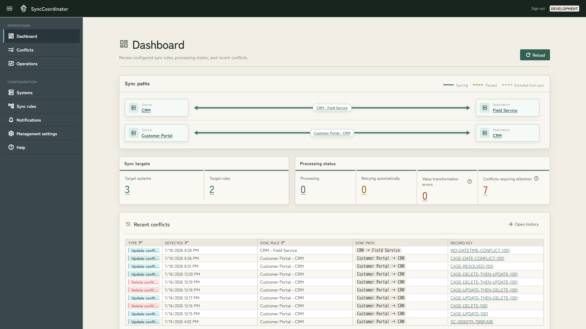
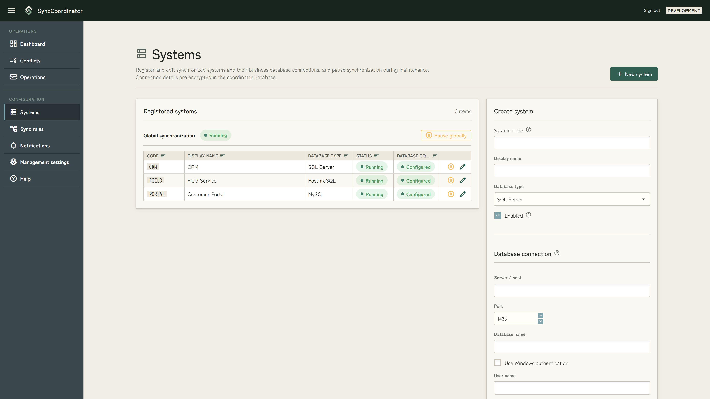
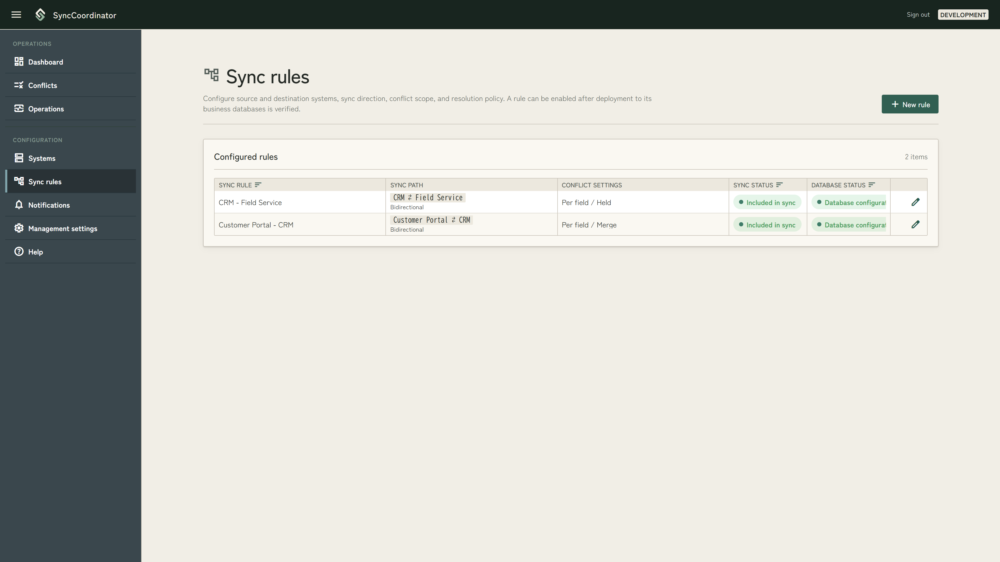
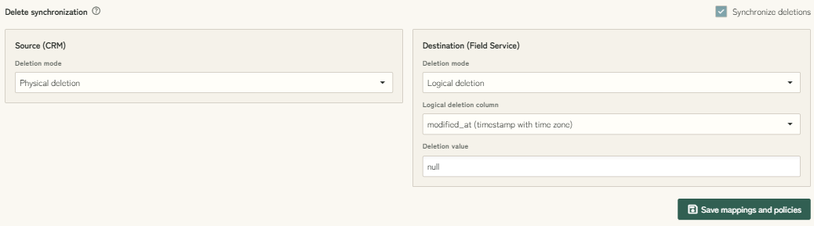
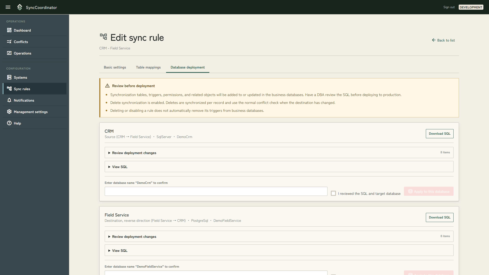
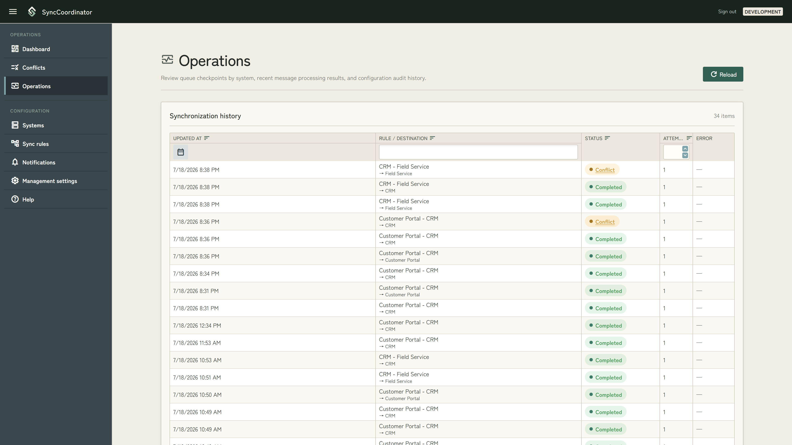
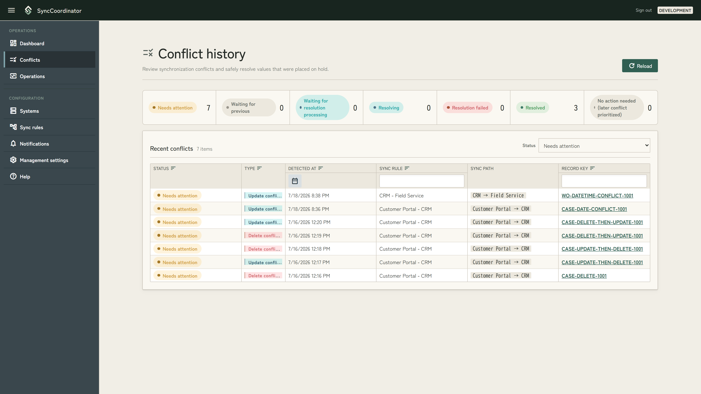
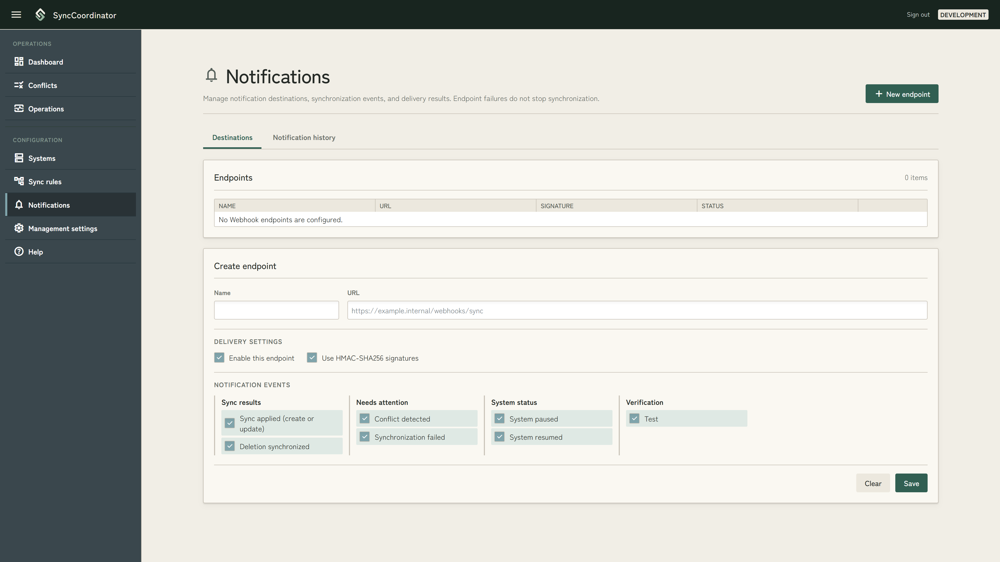
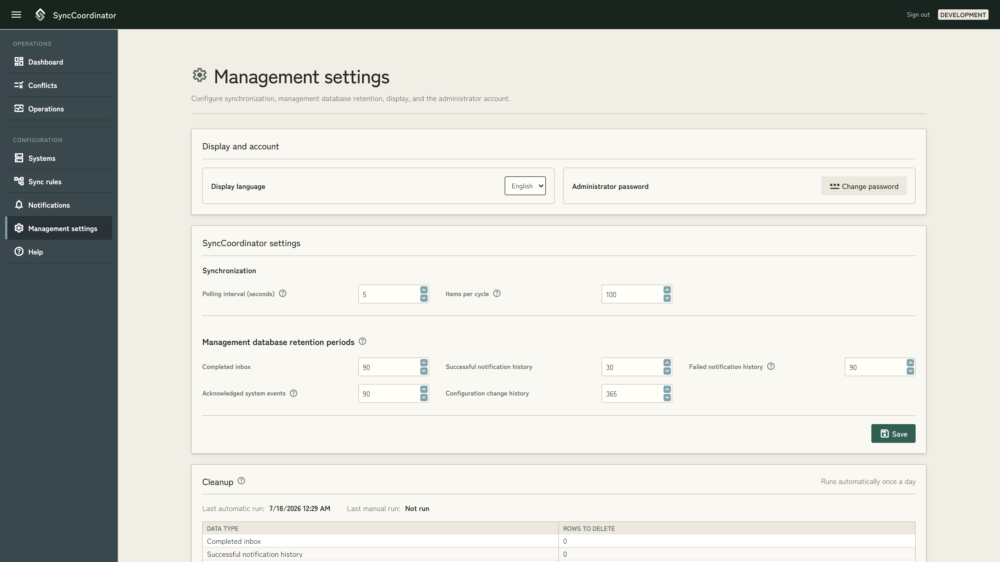

# SyncCoordinator User Guide

This guide is for administrators who configure and operate synchronization through the SyncCoordinator management UI.

Screen and button names follow the English display. The workflow is the same when the display language is switched to Japanese.

## Contents

- [Before you start](#before-you-start)
- [Initial setup and sign-in](#initial-setup-and-sign-in)
- [Check overall status on the dashboard](#check-overall-status-on-the-dashboard)
- [Register systems and database connections](#register-systems-and-database-connections)
- [Create a sync rule](#create-a-sync-rule)
- [Configure a table mapping](#configure-a-table-mapping)
- [Deploy to business databases and start synchronization](#deploy-to-business-databases-and-start-synchronization)
- [Pages to check during normal operations](#pages-to-check-during-normal-operations)
- [Pause and resume synchronization](#pause-and-resume-synchronization)
- [Investigate value transformation errors, conflicts, and automatic retries](#investigate-value-transformation-errors-conflicts-and-automatic-retries)
- [Review conflicts](#review-conflicts)
- [Configure notifications](#configure-notifications)
- [Change management settings](#change-management-settings)
- [Change or reset the password](#change-or-reset-the-password)
- [Terms and status meanings](#terms-and-status-meanings)
- [Current limitations and operational notes](#current-limitations-and-operational-notes)

## Before you start

Use the following basic sequence to start synchronization.

1. Set the administrator password and sign in.
2. Register the source and destination systems and their database connections.
3. Create a sync rule.
4. Save the table and column mapping.
5. Deploy the synchronization objects to every business database involved in the rule.
6. Verify the database configuration.
7. Include the sync rule in synchronization.
8. Confirm operation on the Dashboard and Operations pages.

Before changing configuration, pause the affected system or global synchronization and review the scope of the change. Pausing and removing a rule from synchronization serve different purposes. Use a pause for maintenance when processing should catch up from accumulated notifications afterward. Rules do not have an individual pause control; use “Include in synchronization” or “Remove from synchronization” to change whether a rule participates in the configuration.

## Initial setup and sign-in

### Set up the administrator

If no administrator has been registered, open the management UI through `localhost` on the Web server. You are redirected to the administrator setup page.

1. Enter the new password and confirmation password.
2. Select “Create administrator.”
3. Return to the sign-in page.

The username is fixed as `admin`. Set a password between 12 and 128 characters. Initial setup can be performed only through `localhost` on the Web server; it is not available from another computer.

### Sign in

1. Enter the username `admin` and the password.
2. Select “Keep me signed in” if necessary.
3. Select “Sign in.”

After signing in, the Dashboard appears. Use the menu on the left to move between operations and configuration pages. Select “Sign out” in the upper-right corner when you finish.

## Check overall status on the dashboard

The Dashboard summarizes sync paths, target counts, currently processing items, and recent conflicts.

### Sync paths

All registered rules appear under Sync paths. Scroll within this area when many rules are registered.

| Display | Meaning |
| --- | --- |
| Solid green line | Synchronizing |
| Dashed orange line | Paused globally, paused individually, or paused for mapping maintenance |
| Dashed gray line | Excluded from synchronization |
| One-way arrow | One-way synchronization |
| Two-way arrow | Bidirectional synchronization |

Select a system name to open that system on the Systems page. Select a path name to open the sync rule editor.

### Metrics

| Metric | Meaning |
| --- | --- |
| Target systems | Number of enabled systems, including paused systems |
| Target rules | Number of enabled rules included in synchronization, including paused rules |
| Processing | Synchronization messages currently claimed by the Worker |
| Retrying automatically | Messages that failed because of a transient error and will be retried by the Worker |
| Value transformation errors | Messages held because value transformation or pre-write validation failed |
| Conflicts requiring attention | Conflicts awaiting an operator decision or whose manual resolution could not be applied |

Select a Target ID under Recent conflicts to open its conflict details. The Dashboard shows the 20 most recent conflicts.

## Register systems and database connections

Open “Systems” from the left menu. Register both the synchronization source and destination as separate systems.

### Register a new system

1. Select “New system.”
2. Enter the system code, display name, and database type.
3. Turn on “Enabled.”
4. Enter the database connection details.
5. Select “Test connection” and review the success message or warning.
6. Select “Save.”

Supported database types are SQL Server, MySQL, and PostgreSQL.

The system code identifies the system in sync rules and queue read positions. It cannot be changed after registration. Specify a code that is unique within the environment and remains stable during operation.

You can save the system without entering database connection details. A saved connection is required before the mapping page can read tables and columns.

### Understand connection test results

“Test connection” connects to the database using the values currently entered on the page. The test does not save those values, so select “Save” after reviewing the result.

If “Connected with a warning” appears, review the warning details. A warning about the Unicode round-trip check means that the database or runtime character encoding settings should be reviewed. The connection test does not verify permission to deploy database objects, so confirm DDL permissions separately before deployment.

To keep an existing saved password, leave the password field blank when editing. Saved connection changes are used from the next Worker cycle; restarting the Worker is not required. “Trust the server certificate” is intended for development environments. Use a certificate that can be validated correctly in production.

### Choose between enabled, paused, and disabled

- Turning off “Enabled” removes the system from the synchronization configuration.
- Use the pause button in the system list to stop synchronization temporarily for maintenance and catch up from accumulated notifications after resuming.
- A system used by an enabled sync rule cannot be disabled. Remove the related rules from synchronization first.

Systems cannot currently be deleted. To retire a system, remove its related rules from synchronization and then disable the system.

## Create a sync rule

Open “Sync rules” from the left menu and select “New rule.”

1. Enter a rule name that operators can identify easily.
2. Select the source and destination systems.
3. Select one-way or bidirectional synchronization.
4. Select the conflict detection scope.
5. Select the default conflict policy.
6. Select “Save settings.”

A new rule is created as “Not synchronized” and “Draft.” Saving basic settings alone does not start synchronization.

### Synchronization direction

- One-way: Synchronizes from the source to the destination.
- Bidirectional: Sends changes made to data previously synchronized to the destination back to the source. It does not send records created independently at the destination to the source.

### Conflict settings

The detection scope is either “Per field” or “Per record.” Select one of the following default policies.

| Policy | Behavior |
| --- | --- |
| Held | Does not apply the conflicting value automatically and leaves it for operator review |
| Use source | Uses the value received from the source |
| Keep destination | Keeps the current destination value |
| Merge | Attempts to merge the values and holds the conflict if they cannot be merged |

Override the default policy on the table mapping page when individual fields require different policies.

### Change an existing rule

- The rule name, conflict detection scope, and default policy can be changed under basic settings.
- The source, destination, and direction cannot be changed after the database configuration has been verified. Such changes require a migration plan that includes retiring the existing triggers.
- If the source, destination, or direction is changed while the database configuration is still a draft, the rule remains not synchronized and database deployment must be reviewed from the beginning.
- Both systems must be enabled and the database configuration must be verified before a rule can be included in synchronization.
- Rules cannot currently be deleted. Use “Remove from synchronization” to stop using a rule.

## Configure a table mapping

Open the “Table mapping” tab in the sync rule editor. Both systems require saved database connections.

1. Select the source and destination tables.
2. Select the columns to synchronize.
3. Select the destination column corresponding to each source column.
4. Mark the column that uniquely identifies a record as the key.
5. Override the rule's default conflict policy only for columns that require a different policy.
6. Configure value transformations, fixed values, and delete synchronization as necessary.
7. Select “Save mappings and policies.”

Columns with the same name are selected as initial candidates. Use “Search columns” and “Unmapped only” to review tables with many columns.

### Value transformations

Value transformations can be configured for mapped columns other than keys. A one-way rule shows only the transformation applied when writing to the destination. A bidirectional rule also shows the transformation for the return direction. Confirm that transformed values satisfy the destination column's data type, nullability, length, precision, and scale. Values that cannot be validated are held as “Needs attention.”

### Fixed values

A fixed value writes a constant to a column separately from the normal column mapping. A column used by the normal mapping cannot also be selected as a fixed-value destination. For bidirectional rules, select whether the value is written toward the destination or back toward the source.

### Delete synchronization

Turn on “Synchronize deletions” to propagate source deletions to the destination. Select physical or logical deletion for each system.

- Physical deletion: Stores the values before deletion in a synchronization tombstone so the deletion can be detected.
- Logical deletion: Treats an update that changes the configured field to the configured value as a deletion.

When delete synchronization is off, physical deletions are not synchronized. Changes to a logical-delete field are handled as normal updates.

### After saving a mapping

For safety, saving a mapping removes the rule from synchronization. If a mapping that has already been used in operation is changed, “Mapping maintenance” is also displayed. Changes that affect database configuration, such as column correspondence, keys, or delete strategy, return the database status to “Draft.” Changing only value transformations preserves the verified database configuration.

The table selectors are disabled after the database configuration has been verified. Changing the target tables requires a migration plan that includes retiring the existing triggers.

Open the “Database deployment” tab, review the database status, deploy or verify the configuration as necessary, and then include the rule in synchronization again from the basic settings tab.

When an existing mapping is saved, SyncCoordinator first removes the rule from synchronization and waits for in-progress deliveries to finish. If a save error or timeout prevents the change from being committed, the previous synchronization and mapping-maintenance states are restored. Resolve the cause and save again.

## Deploy to business databases and start synchronization

Open the “Database deployment” tab in the sync rule editor. For each database, you can review the synchronization tables, triggers, permissions, and SQL that will be created or updated.

### Recommended procedure: have a DBA review and run the SQL

1. Open “Review deployment changes” and “View SQL” for each target database.
2. Select “Download SQL.”
3. Have a DBA review the target database, required permissions, and SQL.
4. Have the DBA run the SQL against each target database.
5. After deployment to every target database, select “Verify all database configurations.”
6. Confirm that the status is “Verified.”
7. Return to Basic settings and select “Include in synchronization.”

### Deploy directly from the management UI

“Apply to this database” is available only in environments where direct deployment from the management UI is allowed.

1. Review the SQL and planned changes.
2. Enter the database name displayed on the page exactly in the confirmation field.
3. Select “I reviewed the SQL and target database.”
4. Select “Apply to this database.”
5. Repeat for every target database, and then verify all database configurations.

In production, SQL execution should follow change-management and review procedures. Database deployment changes the business database. Confirm backups, execution permissions, and the maintenance window in advance.

Removing a rule from synchronization does not automatically remove triggers already created in the business databases.

## Pages to check during normal operations

### Dashboard

Use the Dashboard as the starting point. Confirm that sync paths are green, that “Value transformation errors,” “Conflicts requiring attention,” and “Retrying automatically” are not increasing, and review recent conflicts. Select “Reload” to retrieve the latest information.

### Operations

The “Operations” page in the left menu contains the following information.

| Area | What to check |
| --- | --- |
| Queue read positions | Last Queue ID and update time for each source system |
| Synchronization history | Rule, destination, status, attempts, and errors |
| System events | Warnings and errors from the management UI, databases, synchronization, and Webhooks |
| Configuration audit history | Changes to systems, rules, mappings, database deployment, accounts, and management settings |

Select “Show” for an error or event to review its details and identifiers. “Acknowledge” on a system event records that an operator reviewed the event. It does not repair the cause or retry synchronization.

These pages show only recent information. Synchronization history and system events show up to 200 entries each, and configuration audit history shows up to 100 entries.

## Pause and resume synchronization

Use the “Systems” page in the left menu to pause synchronization.

### Pause all synchronization

Select “Pause globally” under Global synchronization. The Dashboard and lists show included paths and systems as paused.

To resume, select “Release global pause.” This releases only the global pause. Systems that were already paused individually remain paused.

### Pause synchronization involving a specific system

Select the pause icon for the target system. Rules that use that system as either source or destination stop. Select the resume icon to catch up from accumulated notifications to the latest state.

Individual pause and resume buttons cannot be used while global synchronization is paused. Release the global pause first.

### Pause considerations

- A pause takes effect at a Worker cycle boundary, so processing that has already started may finish.
- Synchronization and checkpoint updates stop, but Webhook delivery and management database cleanup continue.
- Checkpoints are maintained per source system. A rule involving a paused destination may cause another rule using the same source to wait.
- Use a pause for maintenance. Turning off “Enabled” or removing a rule from synchronization removes it from the active configuration and serves a different purpose.

## Investigate value transformation errors, conflicts, and automatic retries

Review the counts on the Dashboard and open “Operations” from the left menu.

### Retrying automatically

This status indicates a transient failure, such as a database connection problem. The Worker retries automatically in a later cycle.

1. Show the error in Synchronization history.
2. Review system events from the same time.
3. Check the connection test on the Systems page, the target database, network, and permissions.
4. Resolve the cause and confirm that the status changes to Completed.

There is currently no maximum-attempt cutoff or manual retry action. Automatic retries continue until the cause is resolved, and the checkpoint for the affected source may stop advancing.

### Value transformation errors

This status means a value could not be applied automatically during transformation or pre-write validation. Common causes include:

- The transformed value does not satisfy a destination-field constraint.
- A fixed value or data type fails pre-write validation.

Review the error in Synchronization history and the related system events. A validation error cannot be corrected and retried from the management UI. Correct the source data or mapping and generate another change if necessary.

### Conflicts requiring attention

This status indicates that an operator decision is required because a hold policy was used or the conflict could not be merged. Open “Conflicts” from the left menu and choose the incoming value, the current destination value, a manually entered value, or the handling of a deletion.

## Review conflicts

Open “Conflicts” from the left menu. The initial filter is “Needs attention.” You can switch to “Waiting for previous,” “Waiting for resolution processing,” “Resolving,” “Resolution failed,” “Resolved,” “No action needed,” or “All,” and filter or sort by detection time, sync rule, and record key. Up to 500 recent entries are available.

Select the details button at the end of a row to review the following values for each field.

- Previous value: The value recorded at the previous synchronization.
- Incoming value: The value received from the source this time.
- Current value: The latest value in the destination database when the details page was opened.
- Selected value: The value selected after applying the policy.
- Policy: The policy applied to the field.
- Result: The decision, such as using the source, keeping the destination, or holding the value.

For an update conflict requiring attention, choose “Use incoming value,” “Keep destination value,” or “Enter a value” for each field. The physical field correspondence from the incoming side to the destination appears under the destination field name. Use “Use all incoming” or “Keep all current” first, and then change individual fields as necessary.

For a delete conflict, choose “Apply the incoming deletion to the destination” or “Keep the destination record.” Enter a reason if necessary and select “Queue resolution.” Submitting a resolution does not update the business database immediately. The Worker checks the current destination value again before applying the resolution. If the value changed after it was displayed, the Worker does not overwrite it and returns the conflict to Needs attention so the latest value can be reviewed.

When conflicts overlap for the same sync path and record key, the oldest and newest conflicts can be operated on. Resolving from the oldest conflict reevaluates the next conflict using the updated current value and snapshot; if no conflict remains, processing advances automatically. Prioritizing the newest conflict marks older unresolved conflicts as “No action needed” and makes them unavailable. With three or more conflicts, intermediate entries appear as “Waiting for previous.”

## Configure notifications

Open “Notifications” from the left menu. Notification destinations are Webhook endpoints.

### Register a notification endpoint

1. Select “New endpoint.”
2. Enter a name and an HTTP or HTTPS URL.
3. Select “Enable this endpoint.”
4. In most cases, turn on “Use HMAC-SHA256 signatures.”
5. Select at least one notification event.
6. Select “Save.”
7. If signatures are enabled, copy the displayed signing secret immediately and configure it securely at the receiver.

The signing secret is shown only when an endpoint is created or the secret is regenerated. The same value cannot be displayed later. Regenerating it also requires updating the receiver.

HTTP does not encrypt the payload or signature. Use HTTPS outside a closed internal network.

### Edit or delete a notification endpoint

- Edit: Select the edit icon, change the settings, and select “Save.” To change the signing secret, turn on “Generate a new signing secret when saving” and configure the new value at the receiver.
- Disable: Turn off “Enable this endpoint” on the edit page and save.
- Delete: Select the delete icon and confirm the endpoint name on the confirmation page.

Disable an endpoint instead of deleting it when delivery should stop only temporarily. Before deleting an endpoint, remove dependencies on it from the receiver and operational procedures.

### Test an endpoint

Select the send icon in the endpoint list to queue a test notification. Check the result under “Notification history.” Selecting the test button only queues delivery; it does not mean delivery has completed. Select “Reload” after the Worker processes it.

### Notification history

Statuses are Pending, Processing, Waiting to retry, Delivered, and Failed. A notification endpoint failure does not stop synchronization.

Notification history shows up to 200 recent entries. Failed Webhook deliveries cannot be resent manually from the management UI. Repair the endpoint and use a new test notification as necessary.

## Change management settings

Open “Management settings” from the left menu.

### Display and account

- Display language: Select Japanese or English for this browser. The page updates immediately after selection.
- Administrator password: Open the standard change-password page from “Change password.”

### SyncCoordinator settings

| Setting | Input range | Applied |
| --- | --- | --- |
| Polling interval | 1–300 seconds | From the next Worker cycle |
| Items per cycle | 1–5000 items | From the next synchronization and notification-delivery cycle |
| Completed inbox | 0, or 30–3650 days | From the next cleanup |
| Other retention periods | 0, or 1–3650 days | From the next cleanup |

Use 0 to retain data indefinitely. Select “Save” after entering the values.

Retention periods can be configured for completed inbox entries, successful notification history, failed notifications whose retries are exhausted, acknowledged system events, and configuration audit history. Unacknowledged system events are retained regardless of age.

### Cleanup

Automatic cleanup runs once a day. To run cleanup manually:

1. Select “Refresh preview.”
2. Review the count for each data type and the total.
3. Select “Clean up now.”
4. Review the counts in the confirmation dialog and select “Delete rows.”

Deletion cannot be undone. Snapshots, checkpoints, conflicts, and synchronization configuration that are not listed as deletion candidates are not removed by this cleanup.

## Change or reset the password

### When you know the current password

1. Open “Management settings.”
2. Select “Change password.”
3. Enter the current password, new password, and confirmation password.
4. Select “Change password.”
5. Select “Back to management settings.”

After the password is changed, sign-in cookies issued before the change become invalid.

### When you forgot the password

For security, the password can be reset only through `localhost` on the Web server.

1. Open the sign-in page through `localhost` on the Web server.
2. Select “Forgot your password?”
3. Enter the new password and confirmation password.
4. Select “Reset password.”
5. Return to the sign-in page and sign in with the new password.

Resetting the password invalidates existing sign-in cookies. It does not change synchronization settings, history, or synchronization state in the coordinator database. The reset link is not displayed on the sign-in page when accessed from a remote computer.

## Terms and status meanings

### Main terms

| Term | Meaning |
| --- | --- |
| System | Registration unit for a business system and database connection used as a synchronization source or destination |
| Sync rule | Configuration that combines the source, destination, direction, and conflict policies |
| Mapping | Correspondence between synchronized tables, columns, keys, value transformations, fixed values, and delete strategies |
| Queue | Change notification in a business database that tells the Worker that data changed |
| Checkpoint | Last Queue ID read by the Worker for each source system |
| Inbox | Synchronization processing state for each rule and destination; also used to prevent duplicate processing |
| Snapshot | Value at the previous synchronization, used as the baseline for detecting the current change and conflicts |
| Conflict | State in which both source and destination changed the same data after the previous synchronization and their values differ |
| Notification | Webhook that sends synchronization results or system status to an external endpoint |

### System and rule statuses

| Status | Meaning |
| --- | --- |
| Running / Synchronizing | Enabled and not paused |
| Paused | Synchronization is stopped while keeping the configuration active |
| Globally paused | Synchronization is stopped by the global pause, independently of individual pauses |
| Included in sync | The rule is enabled and participates in synchronization |
| Not synchronized | The rule is disabled; this differs from a maintenance pause |
| Mapping maintenance | Synchronization is stopped safely while saving a mapping change |
| Draft | Required business database configuration is unverified or must be redeployed |
| Database configuration verified | Required synchronization objects have been verified in the target databases |

### Synchronization processing statuses

| Status | Meaning | Basic response |
| --- | --- | --- |
| Processing | The Worker is currently processing the message | Review events and database connections if it continues for a long time |
| Completed | Synchronization processing finished | No action required |
| Retrying automatically | A transient failure occurred and the Worker will retry | Resolve the error and confirm that the status changes to Completed |
| Value transformation error | Processing was held by value transformation or pre-write validation | Review the error and events, then correct the source data or mapping |
| Conflict requiring attention | A conflict is waiting for a decision or its resolution could not be applied | Select values and resolve it from the conflict details page |

## Current limitations and operational notes

### Operations not currently available

- Manually retry items requiring attention or failed items from the management UI.
- Compare all source and destination records or repair them automatically.
- Export configuration audit history or other audit history to a file.
- Manually resend a failed Webhook delivery.
- Delete systems or sync rules.
- Automatically remove business database triggers when a rule is removed from synchronization.

### Operational notes

- Pages labeled “Recent” or “History” show a limited number of recent entries rather than every row in the coordinator database.
- Bidirectional synchronization does not import records created independently at the destination back to the source.
- The Queue is a change notification used to retrieve the latest state, not a complete history of business events. Do not use it when every intermediate state must be delivered externally.
- “Acknowledge” records that a system event was reviewed; it does not repair the cause or retry processing.
- Before changing database configuration, review the SQL, backups, permissions, and rollback procedure.
- The source, destination, direction, and target tables of a rule with a verified database configuration cannot be changed in place. Prepare a migration plan that includes retiring existing triggers.
- Do not copy passwords from displayed connection strings or Webhook signing secrets into tickets, chat messages, or screenshots.
