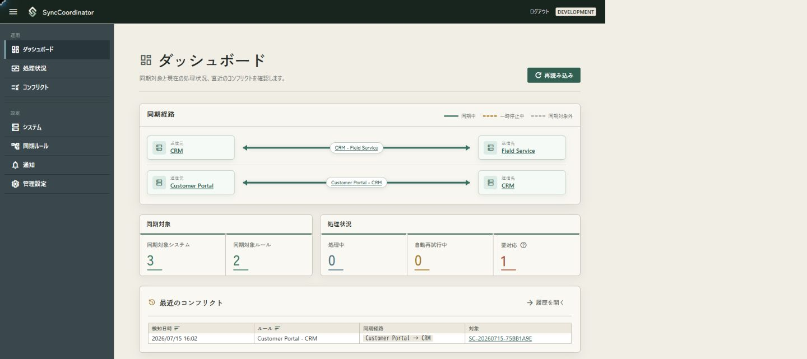
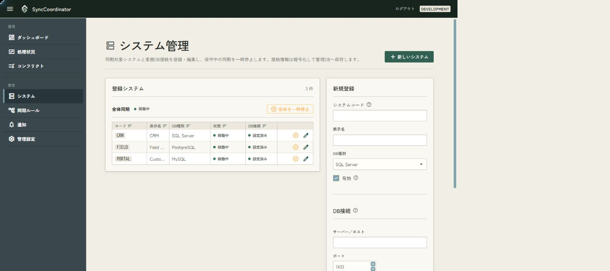
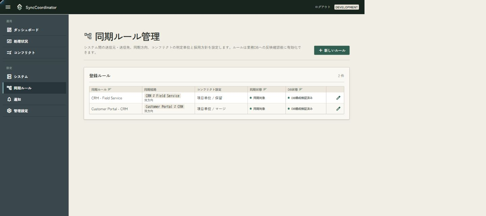
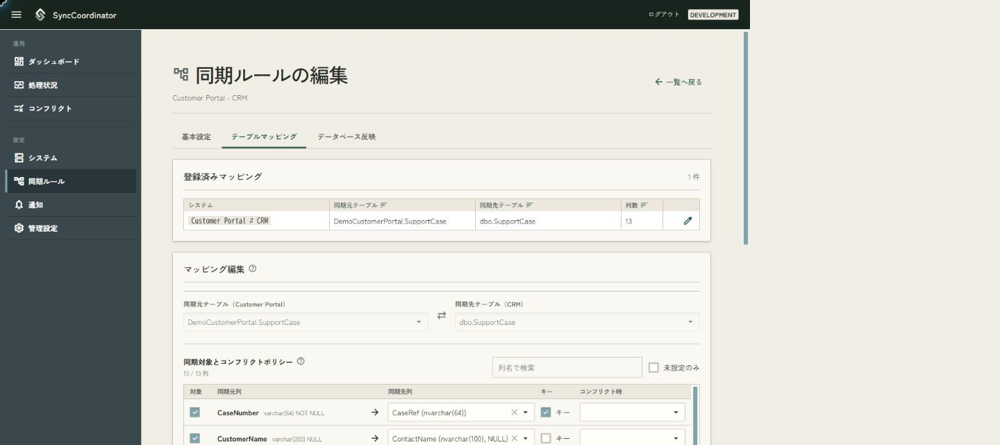
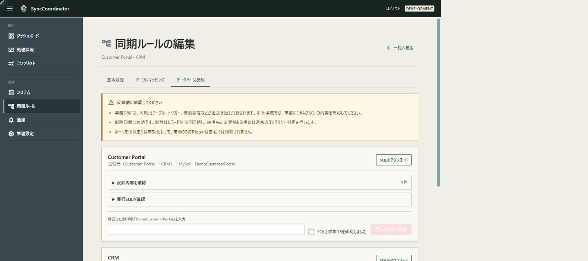
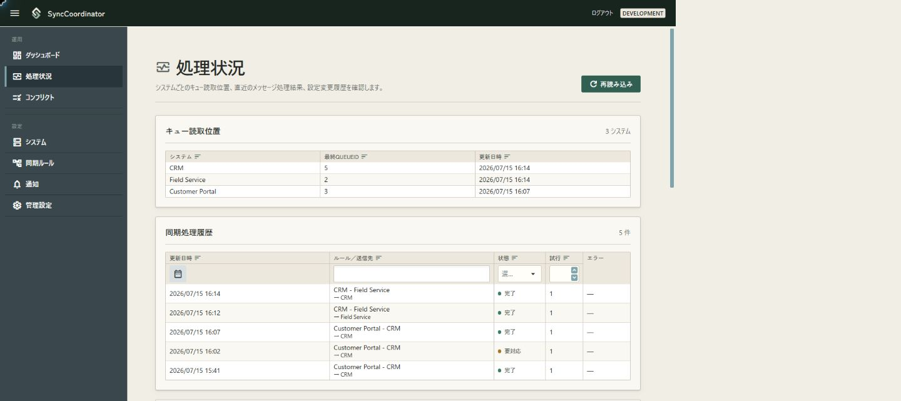
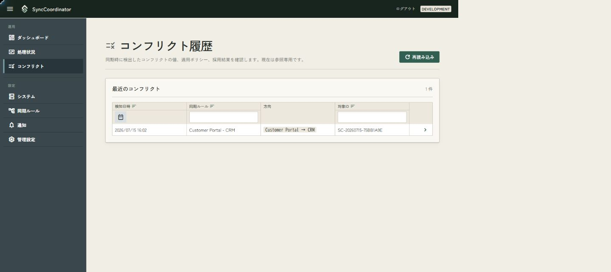
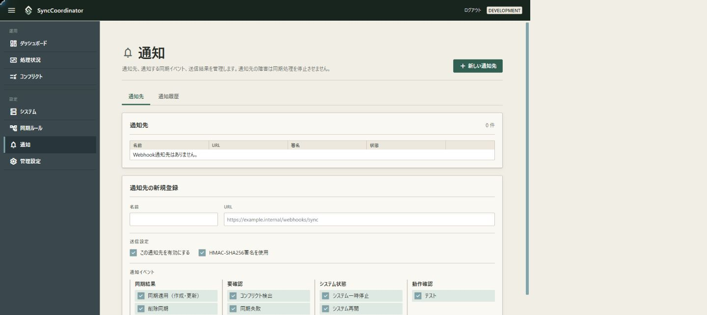
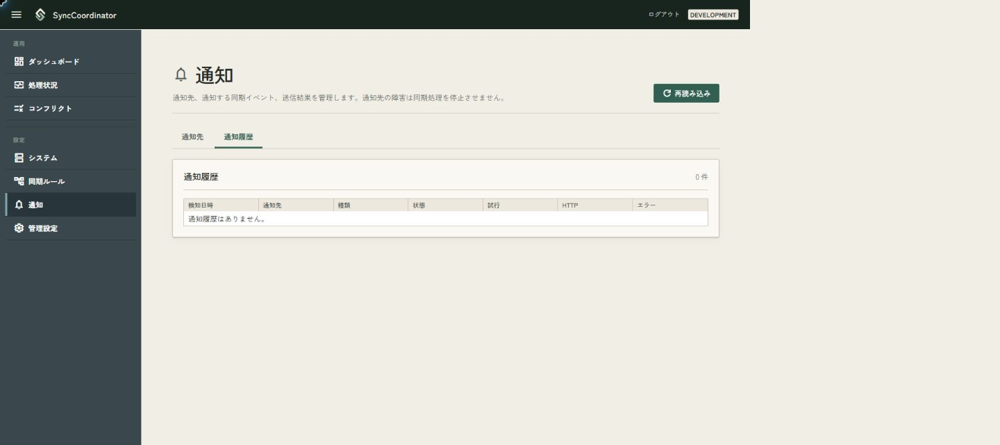
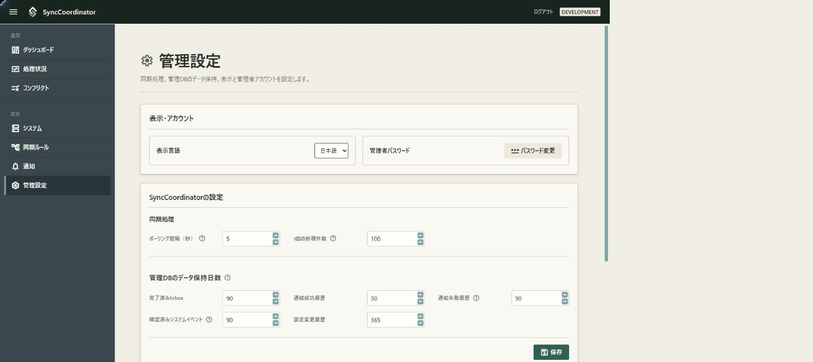

# SyncCoordinator 操作マニュアル

この操作マニュアルは、SyncCoordinatorの管理画面を使って同期を設定・運用する管理者向けです。

画面名やボタン名は日本語表示を基準にしています。英語へ切り替えた場合も操作の流れは同じです。

## 目次

- [最初に確認すること](#最初に確認すること)
- [初回設定とログイン](#初回設定とログイン)
- [ダッシュボードで全体を確認する](#ダッシュボードで全体を確認する)
- [システムとDB接続を登録する](#システムとdb接続を登録する)
- [同期ルールを作成する](#同期ルールを作成する)
- [テーブルマッピングを設定する](#テーブルマッピングを設定する)
- [業務DBへ反映し、同期を開始する](#業務dbへ反映し同期を開始する)
- [通常運用で確認する画面](#通常運用で確認する画面)
- [同期を一時停止・再開する](#同期を一時停止再開する)
- [要対応・自動再試行中を調査する](#要対応自動再試行中を調査する)
- [コンフリクトを確認する](#コンフリクトを確認する)
- [通知を設定する](#通知を設定する)
- [管理設定を変更する](#管理設定を変更する)
- [パスワードを変更・再設定する](#パスワードを変更再設定する)
- [用語と状態の意味](#用語と状態の意味)
- [現在できない操作と注意事項](#現在できない操作と注意事項)

## 最初に確認すること

同期を開始するまでの基本順序は次のとおりです。

1. 管理者パスワードを初期設定してログインする。
2. 送信元と送信先のシステム、DB接続を登録する。
3. 同期ルールを作成する。
4. テーブルと列のマッピングを保存する。
5. 対象となるすべての業務DBへ同期用オブジェクトを反映する。
6. DB構成を検証する。
7. 同期ルールを「同期対象」にする。
8. ダッシュボードと処理状況で稼働を確認する。

設定変更中は、先に対象システムまたは全体同期を一時停止して影響範囲を確認してください。「一時停止」と「同期対象外」は用途が異なります。保守後に通知へ追いつかせる場合は一時停止を使います。ルール単位には一時停止操作がなく、「同期対象にする／同期対象から外す」で構成への参加を切り替えます。

## 初回設定とログイン

### 管理者を初期設定する

管理者がまだ登録されていない場合、Webサーバー上で`localhost`の管理画面を開くと、管理者の初期設定画面へ移動します。

1. 「新しいパスワード」と確認用パスワードを入力する。
2. 「管理者を設定」を押す。
3. ログイン画面へ戻る。

ユーザー名は`admin`固定です。パスワードは12文字以上128文字以下で設定してください。初期設定はWebサーバー上の`localhost`からだけ実行できます。別のPCからは実行できません。

### ログインする

1. ユーザー名`admin`とパスワードを入力する。
2. 必要に応じて「ログイン状態を保持する」を選ぶ。
3. 「ログイン」を押す。

ログイン後はダッシュボードが表示されます。画面左側のメニューから運用画面と設定画面へ移動します。終了するときはヘッダー右上の「ログアウト」を押してください。

## ダッシュボードで全体を確認する

ダッシュボードでは、同期経路、対象数、現在処理中の件数、最近のコンフリクトをまとめて確認できます。

### 同期経路

同期経路には登録済みのルールがすべて表示されます。件数が多い場合は、経路の領域内をスクロールしてください。

| 表示 | 意味 |
| --- | --- |
| 緑の実線 | 同期中 |
| オレンジの破線 | 全体停止、個別停止、またはマッピング変更による一時停止中 |
| グレーの破線 | 同期対象外 |
| 片向きの矢印 | 片方向同期 |
| 両向きの矢印 | 双方向同期 |

システム名を押すとシステム管理の対象システムが、経路名を押すと同期ルールの編集画面が開きます。

### 指標

| 指標 | 意味 |
| --- | --- |
| 同期対象システム | 「有効」になっているシステム数。一時停止中のシステムも含みます。 |
| 同期対象ルール | 「同期対象」になっているルール数。一時停止中のルールも含みます。 |
| 処理中 | Workerが処理権を取得している同期メッセージ数 |
| 自動再試行中 | 一時的なエラーで失敗し、Workerが次回以降に再試行するメッセージ数 |
| 要対応 | 自動処理を続けられず、データまたは設定の確認が必要なメッセージ数 |

「最近のコンフリクト」の対象IDを押すと、そのコンフリクトの詳細が開きます。ダッシュボードに表示されるのは直近20件です。

## システムとDB接続を登録する

左メニューの「システム」を開きます。同期元と同期先の両方を、それぞれシステムとして登録してください。

### 新しいシステムを登録する

1. 「新しいシステム」を押す。
2. システムコード、表示名、DB種別を入力する。
3. 「有効」をオンにする。
4. DB接続情報を入力する。
5. 「接続テスト」を押し、成功または警告内容を確認する。
6. 「保存」を押す。

対応するDB種別はSQL Server、MySQL、PostgreSQLです。

システムコードは同期ルールとキュー読取位置の識別に使われ、登録後は変更できません。環境内で重複せず、運用中も変わらないコードを指定してください。

DB接続情報を入力せずにシステムだけを保存することもできます。ただし、マッピングでテーブルや列を読み取る前に接続情報が必要です。

### 接続テストの見方

「接続テスト」は画面に入力中の内容でDBへ接続します。接続テストだけでは入力内容を保存しないため、結果を確認したあとに「保存」を押してください。

「接続できましたが確認が必要です」と表示された場合は、警告の内容を確認してください。Unicode文字列の往復確認に関する警告がある場合は、DBまたは実行環境の文字コード設定を確認します。接続テストはDB構成の反映権限までは検証しないため、DDL実行権限は反映前に別途確認してください。

保存済みのパスワードを変更しない場合は、編集時のパスワード欄を空欄のまま保存します。保存した接続情報の変更は次のWorker周期から使用され、Workerの再起動は不要です。「サーバー証明書を信頼」は開発環境向けです。本番環境では正しく検証できる証明書を使用してください。

### 有効、一時停止、無効の使い分け

- 「有効」をオフにすると、そのシステムを同期構成から外します。
- 一覧の一時停止ボタンは、保守中だけ同期を止め、再開後に蓄積した通知へ追いつかせるために使います。
- 有効な同期ルールで使用中のシステムは無効化できません。先に関連ルールを同期対象外にしてください。

システムを削除する操作はありません。使用しなくなったシステムは、関連ルールを同期対象外にしてから無効化します。

## 同期ルールを作成する

左メニューの「同期ルール」を開き、「新しいルール」を押します。

1. 運用者が識別しやすいルール名を入力する。
2. 送信元システムと送信先システムを選ぶ。
3. 片方向または双方向を選ぶ。
4. コンフリクトの判定単位を選ぶ。
5. 既定のコンフリクトポリシーを選ぶ。
6. 「設定を保存」を押す。

新規ルールは「同期対象外」「下書き」で作成されます。基本設定を保存しただけでは同期は開始されません。

### 同期方向

- 片方向: 送信元から送信先へ同期します。
- 双方向: 送信元から送信先へ同期したデータについて、送信先側の変更を送信元へ戻します。送信先で独自に作成されたデータを送信元へ送る機能ではありません。

### コンフリクト設定

判定単位は「項目単位」または「レコード単位」です。既定のポリシーは次から選びます。

| ポリシー | 動作 |
| --- | --- |
| 保留 | 競合した値を自動適用せず、要対応として残す |
| 送信元を採用 | 送信元から届いた値を採用する |
| 送信先を維持 | 送信先の現在値を維持する |
| マージ | マージ処理を試みる。マージできない場合は保留する |

列ごとに異なるポリシーを使う場合は、次のテーブルマッピングで上書きします。

### 既存ルールを変更する

- ルール名、コンフリクトの判定単位、既定ポリシーは基本設定から変更できます。
- DB構成検証済みのルールでは、送信元、送信先、同期方向を変更できません。既存トリガーの廃止を含む移行計画が必要です。
- DB構成が下書きの段階で送信元、送信先、同期方向を変更すると、ルールは同期対象外のままになり、DB反映を最初から確認する必要があります。
- ルールを同期対象にするには、両端のシステムが有効で、DB構成が検証済みである必要があります。
- ルールを削除する操作はありません。使用をやめる場合は「同期対象から外す」を使用します。

## テーブルマッピングを設定する

同期ルールの編集画面で「テーブルマッピング」タブを開きます。両システムに保存済みのDB接続が必要です。

1. 同期元テーブルと同期先テーブルを選ぶ。
2. 同期する列にチェックを付ける。
3. 各同期元列に対応する同期先列を選ぶ。
4. レコードを一意に識別する列を「キー」にする。
5. 必要な列だけ、コンフリクト時のポリシーをルール既定から変更する。
6. 必要に応じて値変換、固定値、削除同期を設定する。
7. 「マッピングとポリシーを保存」を押す。

同名の列は初期候補として選択されます。列名検索と「未設定のみ」を使うと、列数が多いテーブルを確認しやすくなります。

### 値変換

キー以外の同期対象列には値変換を設定できます。片方向では送信先へ書く変換だけ、双方向では戻り方向の変換も表示されます。変換後の値が書き込み先列の型、NULL可否、文字数、数値精度を満たすことを確認してください。検証できない値は「要対応」になります。

### 固定値

同期データを書き込むときに、通常の列マッピングとは別の列へ一定値を設定できます。通常のマッピングと同じ書き込み先列は選べません。双方向ルールでは、送信先へ書く方向と送信元へ戻す方向を選びます。

### 削除同期

「削除を同期する」をオンにすると、送信元での削除を送信先へ伝えます。システムごとに物理削除または論理削除を選べます。

- 物理削除: 削除前の値を同期用Tombstoneへ保存して検知します。
- 論理削除: 指定列が指定値へ変わった更新を削除として扱います。

削除同期をオフにした場合、物理削除は同期されません。論理削除列の変更は通常の更新として扱われます。

### マッピング保存後

安全のため、マッピングを保存するとルールは同期対象外になります。稼働に使用した既存マッピングを変更した場合は、状態に「マッピング変更中」も表示されます。列の対応やキーなどDB構成へ影響する変更、または削除方式の変更では、DB状態も「下書き」へ戻ります。値変換だけの変更では、検証済みのDB構成は維持されます。

DB構成検証済みルールでは対象テーブルの選択欄が無効になります。対象テーブルを変える場合は、既存トリガーの廃止を含む移行計画が必要です。

「データベース反映」タブでDB状態を確認し、必要なら反映・再検証したうえで、基本設定タブからルールを再び同期対象にしてください。

既存マッピングの保存では、変更を適用する前にルールを同期対象外にして処理中の配送終了を待ちます。保存エラーや待機タイムアウトで変更を確定できなかった場合は、変更前の同期対象・マッピング保守状態へ戻ります。エラー原因を解消してから保存をやり直してください。

## 業務DBへ反映し、同期を開始する

同期ルールの編集画面で「データベース反映」タブを開きます。対象DBごとに、作成・更新される同期用テーブル、トリガー、権限とSQLを確認できます。

### 推奨手順: SQLを確認してDBAが実行する

1. 各対象DBの「反映内容を確認」と「実行SQLを確認」を開く。
2. 「SQLをダウンロード」する。
3. DBAが対象DB、権限、SQLの内容を確認する。
4. DBAが各対象DBでSQLを実行する。
5. すべての対象DBへの反映後、「すべてのDB構成を検証」を押す。
6. 状態が「検証済み」になったことを確認する。
7. 「基本設定」タブへ戻り、「同期対象にする」を押す。

### 管理画面から直接反映する場合

管理画面からの直接反映が許可された環境だけ「このDBへ反映」を使用できます。

1. SQLと反映内容を確認する。
2. 確認欄へ画面に表示されたDB名を正確に入力する。
3. 「SQLと対象DBを確認しました」をオンにする。
4. 「このDBへ反映」を押す。
5. すべての対象DBについて実行し、最後にDB構成を検証する。

本番環境では、変更管理とレビューを経たSQL実行を推奨します。DB反映は業務DBを変更する操作です。バックアップ、実行権限、メンテナンス時間帯を事前に確認してください。

ルールを同期対象外にしても、業務DBへ作成したトリガーは自動削除されません。

## 通常運用で確認する画面

### ダッシュボード

全体の入口です。同期経路が緑であること、「要対応」と「自動再試行中」が増えていないこと、最近のコンフリクトを確認します。最新情報を取り直す場合は「再読み込み」を押します。

### 処理状況

左メニューの「処理状況」には次の情報があります。

| 領域 | 確認する内容 |
| --- | --- |
| キュー読取位置 | 送信元システムごとの最終QueueIdと更新日時 |
| 同期処理履歴 | ルール、送信先、状態、試行回数、エラー |
| システムイベント | 管理画面、DB、同期、Webhookで発生した警告・エラー |
| 設定変更履歴 | システム、ルール、マッピング、DB反映、アカウント、管理設定の変更履歴 |

エラーやイベントの「表示」を押すと、詳細と識別情報を確認できます。システムイベントの「確認済みにする」は、運用者が内容を確認したことを記録する操作です。原因を修復したり、同期を再実行したりする操作ではありません。

画面には直近の情報だけが表示されます。同期処理履歴とシステムイベントは各200件、設定変更履歴は100件です。

## 同期を一時停止・再開する

一時停止は左メニューの「システム」で操作します。

### すべての同期を止める

「全体同期」の「一時停止」を押します。ダッシュボードと一覧では、同期対象の経路・システムが一時停止中として表示されます。

再開するときは「全体停止を解除」を押します。この操作は全体停止だけを解除します。停止前から個別に一時停止していたシステムは停止を継続します。

### 特定システムを含む同期だけ止める

対象システム行の一時停止アイコンを押します。そのシステムを送信元または送信先に含むルールが停止します。再開アイコンを押すと、蓄積した通知から最新状態へ追いつきます。

全体停止中は個別の一時停止・再開ボタンを操作できません。先に全体停止を解除してください。

### 一時停止時の注意

- 停止はWorkerの周期境界で反映されるため、開始済みの処理が完了する場合があります。
- 同期処理とCheckpoint更新は止まりますが、Webhook通知の配送と管理DBのクリーンアップは継続します。
- Checkpointは送信元システム単位です。停止したシステムを送信先に含むルールがあると、同じ送信元を使う別ルールも待機する場合があります。
- 保守目的では一時停止を使用してください。「有効」をオフにする操作や、ルールを「同期対象外」にする操作は構成から外す操作です。

## 要対応・自動再試行中を調査する

ダッシュボードで件数を確認し、左メニューの「処理状況」を開きます。

### 自動再試行中

DB接続障害などの一時的な失敗です。Workerは次回以降の周期で自動的に再試行します。

1. 同期処理履歴の「エラー」を表示する。
2. 同時刻のシステムイベントを確認する。
3. システム管理の接続テスト、対象DB、ネットワーク、権限を確認する。
4. 原因を解消し、状態が完了へ変わることを確認する。

現在は最大試行回数による打ち切りや手動再実行はありません。原因が解消するまで自動再試行が続き、該当する送信元のCheckpointが進まない場合があります。

### 要対応

自動適用できず、運用者の確認が必要な状態です。主な原因は次のとおりです。

- 保留ポリシーによるコンフリクト
- マージできないコンフリクト
- 値変換後の値が書き込み先列の制約を満たさない
- 固定値やデータ型などの書き込み前検証エラー

同期処理履歴のエラー、システムイベント、コンフリクト履歴を確認してください。コンフリクトは管理画面から解決できます。値検証エラーなど、コンフリクト以外の要対応データを管理画面から修正・再実行する機能はありません。

## コンフリクトを確認する

左メニューの「コンフリクト」を開きます。初期表示は「要対応」です。「前の競合待ち」「解決処理待ち」「解決処理中」「解決失敗」「解決済み」「対応不要（後続優先）」「すべて」へ切り替えられ、検知日時、同期ルール、レコードキーで絞り込み・並べ替えができます。表示対象は直近500件です。

行末の詳細ボタンを押すと、項目ごとに次を確認できます。

- 前回値: 前回の同期時点で記録された値
- 受信値: 今回、送信元から届いた値
- 現在値: 詳細画面を開いた時点で送信先DBにある最新値
- 採用値: ポリシー判定後に採用した値
- ポリシー: その項目へ適用した方針
- 結果: 送信元採用、送信先維持、保留などの判定結果

要対応の更新競合では、項目ごとに「受信値を採用」「同期先の現在値を維持」「値を入力」から選びます。同期先フィールド名の下には、受信側から同期先への物理フィールド対応を表示します。「すべて受信値」「すべて現在値」で一括選択してから、必要な項目だけ変更できます。

削除競合では「受信した削除を同期先へ適用する」または「同期先のレコードを維持する」を選びます。必要に応じて解決理由を入力し、「解決を登録」を押します。登録時点では業務DBを直接更新せず、Workerが同期先の現在値をもう一度確認して適用します。表示後に現在値が変わっていれば上書きせず要対応へ戻るため、最新値を確認して選択し直してください。

同じ同期経路・レコードキーで競合が重なった場合は、最古と最新の競合を操作できます。最古から解決すると、次の競合を更新後の現在値とスナップショットで再評価し、競合がなくなれば自動で先へ進みます。最新を優先して解決すると、それより古い未解決競合は「対応不要（後続優先）」になり、以後は操作できません。3件以上ある場合、中間の競合は「前の競合待ち」として表示されます。

## 通知を設定する

左メニューの「通知」を開きます。通知先はWebhookです。

### 通知先を登録する

1. 「新しい通知先」を押す。
2. 名前とHTTPまたはHTTPSのURLを入力する。
3. 「この通知先を有効にする」を選ぶ。
4. 原則として「HMAC-SHA256署名を使用」をオンにする。
5. 通知するイベントを1件以上選ぶ。
6. 「保存」を押す。
7. 署名を有効にした場合は、表示された署名秘密鍵をその場でコピーし、受信側へ安全に設定する。

署名秘密鍵は新規作成時または再生成時に一度だけ表示されます。あとから同じ値を表示できません。再生成すると受信側の設定更新も必要です。

HTTPでは通信内容と署名が暗号化されません。閉域LAN以外ではHTTPSを使用してください。

### 通知先を編集・削除する

- 編集: 一覧の編集アイコンを押し、設定を変更して「保存」を押します。署名秘密鍵を変える場合は「保存時に署名秘密鍵を再生成」をオンにし、新しい鍵を受信側へ設定します。
- 無効化: 編集画面で「この通知先を有効にする」をオフにして保存します。
- 削除: 一覧の削除アイコンを押し、確認画面で対象名を確認して「削除」を押します。

一時的に配送を止めるだけなら削除せず無効化します。削除前に、受信側や運用手順からその通知先への依存を外してください。

### テストする

通知先一覧の送信アイコンを押すと、テスト通知が送信待ちへ登録されます。「通知履歴」タブで送信結果を確認してください。テストボタンを押した時点では配送完了ではありません。Workerの配送後に「再読み込み」を押して状態を確認してください。

### 通知履歴

状態は「送信待ち」「送信中」「再試行待ち」「送信済み」「送信失敗」です。通知先の障害は同期処理を停止させません。

通知履歴は直近200件を表示します。送信失敗を管理画面から手動再送する機能はありません。必要に応じて通知先を修復し、新しいテスト通知で確認してください。

## 管理設定を変更する

左メニューの「管理設定」を開きます。

### 表示・アカウント

- 表示言語: このブラウザーで使用する日本語または英語を選びます。選択後すぐに反映されます。
- 管理者パスワード: 「パスワード変更」から通常の変更画面を開きます。

### SyncCoordinatorの設定

| 設定 | 入力範囲 | 反映 |
| --- | --- | --- |
| ポーリング間隔 | 1～300秒 | 次のWorker周期から |
| 1回の処理件数 | 1～5000件 | 同期処理と通知配信の次回処理から |
| 完了済みInbox | 0、または30～3650日 | 次回クリーンアップから |
| その他の保持日数 | 0、または1～3650日 | 次回クリーンアップから |

0日は自動削除しない設定です。入力後、「保存」を押してください。

保持日数を設定できるのは、完了済みInbox、通知成功履歴、再試行を終了した通知失敗履歴、確認済みシステムイベント、設定変更履歴です。未確認のシステムイベントは保持期間を過ぎても削除されません。

### クリーンアップ

自動クリーンアップは1日1回実行されます。手動で実行する場合は次の順序で操作します。

1. 「削除対象件数を更新」を押す。
2. 種類ごとの件数と合計を確認する。
3. 「今すぐクリーンアップ」を押す。
4. 確認画面の件数を再確認し、「削除を実行」を押す。

削除は元に戻せません。画面の削除候補に表示されないSnapshot、Checkpoint、コンフリクト、同期設定は、このクリーンアップでは削除しません。

## パスワードを変更・再設定する

### 現在のパスワードが分かる場合

1. 「管理設定」を開く。
2. 「パスワード変更」を押す。
3. 現在のパスワード、新しいパスワード、確認用パスワードを入力する。
4. 「パスワードを変更」を押す。
5. 「管理設定へ戻る」で元の画面へ戻る。

パスワード変更後は、変更前に発行されたログインCookieが無効になります。

### パスワードを忘れた場合

安全のため、パスワード再設定はWebサーバー上の`localhost`からだけ実行できます。

1. Webサーバー上で`localhost`のログイン画面を開く。
2. 「パスワードを忘れた場合」を押す。
3. 新しいパスワードと確認用パスワードを入力する。
4. 「パスワードを再設定」を押す。
5. ログイン画面へ戻り、新しいパスワードでログインする。

再設定すると既存のログインCookieは無効になります。同期設定、履歴、管理DB内の同期状態は変更されません。リモートPCのログイン画面には再設定リンクが表示されません。

## 用語と状態の意味

### 主な用語

| 用語 | 意味 |
| --- | --- |
| システム | 同期元または同期先となる業務システムとDB接続の登録単位 |
| 同期ルール | 送信元、送信先、方向、コンフリクト方針をまとめた設定 |
| マッピング | 同期するテーブル、列、キー、値変換、固定値、削除方式の対応付け |
| Queue | 業務DBで変更があったことをWorkerへ知らせる変更通知 |
| Checkpoint | 送信元システムごとに、Workerが読み終えた最終QueueId |
| Inbox | ルールと送信先ごとの同期処理状態。重複処理の防止にも使用する |
| Snapshot | 前回同期時の値。今回の変更とコンフリクトを判断する基準 |
| コンフリクト | 前回同期後に送信元と送信先の両方が同じデータを変更し、値が一致しない状態 |
| 通知 | 同期結果やシステム状態を外部へ送るWebhook |

### システム・ルールの状態

| 状態 | 意味 |
| --- | --- |
| 稼働中／同期中 | 有効で、一時停止されていない |
| 一時停止中 | 構成を維持したままWorkerの同期を止めている |
| 全体停止中 | 全体一時停止により同期を止めている。個別停止とは別の状態 |
| 同期対象 | ルールが有効で同期対象になっている |
| 同期対象外 | ルールが無効。保守目的の一時停止とは異なる |
| マッピング変更中 | マッピング保存により安全のため同期を止めている |
| 下書き | 必要な業務DB構成が未検証、または再反映が必要 |
| DB構成検証済み | 対象DBに必要な同期用オブジェクトがあることを検証済み |

### 同期処理の状態

| 状態 | 意味 | 基本対応 |
| --- | --- | --- |
| 処理中 | Workerが現在処理している | 長時間続く場合はイベントとDB接続を確認 |
| 完了 | 同期処理が終了した | 対応不要 |
| 自動再試行中 | 一時的な失敗。Workerが再試行する | エラー原因を解消し、完了へ変わるか確認 |
| 要対応 | 自動処理できず保留された | エラー、イベント、コンフリクトを確認 |

## 現在できない操作と注意事項

### 現在できない操作

- 管理画面から要対応・失敗データを手動再実行する。
- 送信元と送信先の全件比較や自動修復を行う。
- 設定変更履歴や監査履歴をファイルへエクスポートする。
- 送信失敗したWebhookを手動再送する。
- システムや同期ルールを削除する。
- ルールを同期対象外にしたとき、業務DBのトリガーを自動削除する。

### 運用上の注意

- 一覧名に「最近」「履歴」とある画面は、管理DBの全件ではなく直近の一定件数を表示します。
- 双方向同期は、送信先で独自作成したデータを送信元へ取り込む機能ではありません。
- Queueは業務イベントの完全な履歴ではなく、対象データの最新状態を確認するための変更通知です。中間状態をすべて外部へ送る用途には使用できません。
- 「確認済みにする」はシステムイベントの確認記録であり、原因の修復や再実行ではありません。
- DB構成を変更するときは、SQLレビュー、バックアップ、権限、ロールバック方法を事前に確認してください。
- DB構成検証済みルールの送信元・送信先・同期方向・対象テーブルは、そのままでは変更できません。既存トリガーの廃止を含む移行計画を立ててください。
- 画面に表示された接続文字列のパスワードやWebhook署名秘密鍵を、チケット、チャット、スクリーンショットへ残さないでください。
